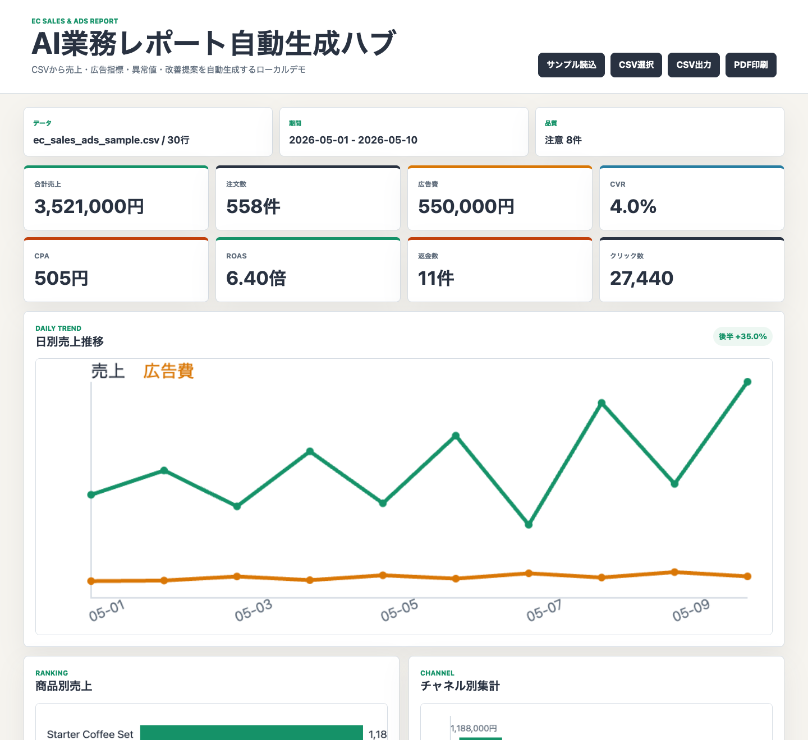

# AI業務レポート自動生成ハブ

EC売上・広告CSVを読み込み、売上サマリー、商品別ランキング、日別推移、広告効率、異常値、AI風分析コメント、改善提案、CSV出力、PDF印刷向けHTMLレポートまでを自動生成するポートフォリオです。

問い合わせ対応や案件管理のようなフロント業務だけでなく、CSVやスプレッドシートを使った集計、可視化、レポート作成、改善提案まで対応できることを見せるために制作しました。

実データ、APIキー、外部AI APIは使いません。サンプルCSVだけで再現できるため、応募先や面談相手に安全に見せられます。



> サンプルCSVを読み込んだ状態のダッシュボードです。KPI、日別推移、商品別・チャネル別レポートを確認できます。

## できること

- CSV読み込み: `date`, `channel`, `product_name`, `orders`, `revenue`, `ad_spend`, `impressions`, `clicks`, `conversions`, `refunds`
- 集計: 合計売上、注文件数、広告費、表示回数、クリック数、CVR、CPA、ROAS、返金数
- 可視化: 日別売上推移、広告費比較、商品別売上ランキング、チャネル別売上
- 分析: 伸びている商品、改善が必要な商品、異常値、データ品質注意
- 提案: ルールベースのAI風分析コメント、次にやるべき施策
- 出力: HTMLレポート、PDF印刷向けレイアウト、レポートCSV出力
- 品質: 0除算、欠損値、不正CSVフォーマットに対応

## デモで確認する流れ

1. ローカルサーバを起動する
2. ブラウザで `http://127.0.0.1:4173` を開く
3. サンプルCSVが自動で読み込まれることを確認する
4. KPI、日別推移、商品別ランキング、チャネル別集計を見る
5. AI風分析コメント、異常値、次アクションを見る
6. `CSV出力` でレポートCSVをダウンロードする
7. `PDF印刷` で印刷向けレイアウトを確認する

## 起動方法

```bash
cd /Users/asoutsukasa/Documents/Work/20_Portfolio_Projects/ai-business-report-hub
npm run dev
```

表示されたURLをブラウザで開きます。通常は以下です。

```text
http://127.0.0.1:4173
```

Node.js / npm がない環境では、Pythonの簡易サーバでも確認できます。

```bash
python3 -m http.server 4173 --bind 127.0.0.1
```

または、同梱のPython起動スクリプトを使えます。

```bash
python3 scripts/dev_server.py
```

## テスト

```bash
npm test
```

Node.js標準の `node:test` だけを使っているため、追加パッケージのインストールは不要です。

Node.jsがない環境では、ブラウザテストランナーを開いて確認できます。

```text
http://127.0.0.1:4173/tests/browser-test-runner.html
```

## サンプルCSV

サンプルデータは [sample_data/ec_sales_ads_sample.csv](sample_data/ec_sales_ads_sample.csv) にあります。

欠損値、広告費が高いのにCVがない商品、返金率が高い商品、日別売上下落などを含め、レポート上で注意点が出るようにしています。

CSVの必須列は [docs/data-schema.md](docs/data-schema.md) に整理しています。

## 画面で見せる価値

単なる集計表ではなく、CSVを読み込んだ後に「何が伸びているか」「どこが悪いか」「次に何を改善すべきか」まで表示します。クラウドワークス・ランサーズ・面談では、CSV集計、可視化、レポート作成、改善提案まで一貫対応できる例として説明できます。

## 安全設計

- 外部送信なし
- 外部AI APIなし
- APIキーなし
- CDNなし
- サンプルデータだけで動作
- 将来のOpenAI API、Google Sheets、GAS、n8n、Slack/Gmail通知連携を見越して、CSV処理・集計・分析コメント生成をモジュール分離

## GitHub Pages公開メモ

このデモはビルド不要の静的サイトです。GitHub Pagesでは、リポジトリのルートを公開元にすれば動きます。

- `index.html` からの参照は相対パスです
- `src/`、`sample_data/`、`docs/` を同じ階層で公開します
- 外部CDNや外部APIは使っていません
- READMEには `docs/screenshots/dashboard.png` の実スクリーンショットを表示しています

## 主な構成

```text
ai-business-report-hub/
├── index.html
├── sample_data/
├── src/
│   ├── app.js
│   ├── csvParser.js
│   ├── analyticsEngine.js
│   ├── aiInsightEngine.js
│   ├── reportEngine.js
│   └── styles.css
├── tests/
├── docs/
│   └── screenshots/
├── README.md
├── PORTFOLIO.md
└── TEST_CHECKLIST.md
```

手動確認項目は [docs/manual-checklist.md](docs/manual-checklist.md)、次回Codexに渡す指示は [docs/next-codex-instructions.md](docs/next-codex-instructions.md) に整理しています。
